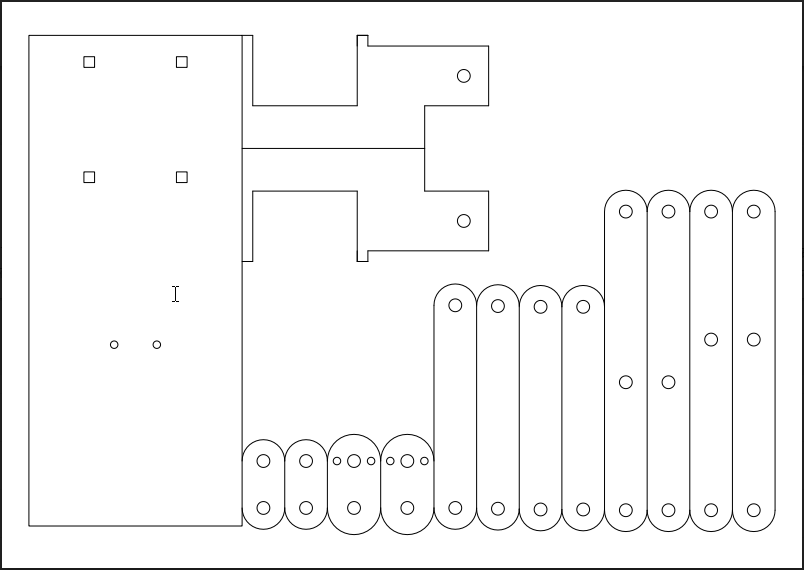

Title:  w13第四組行走機構
Date: 2017-05-17 12:00
Category: Course
Tags: Brython
Slug: Week 13
Author:40439221

 行走機構負責部分說明

<!-- PELICAN_END_SUMMARY -->
<h1>工作內容</h1>
零件繪製、機構模擬、組裝模擬、作動模擬、零件排版與切割
<h1>影片連結</h1>

<iframe width="560" height="315" src="https://www.youtube.com/embed/X4OFK8FOBYo" frameborder="0" allowfullscreen></iframe>

<iframe width="560" height="315" src="https://www.youtube.com/embed/RRHEYAVaWyU" frameborder="0" allowfullscreen></iframe>

<iframe width="560" height="315" src="https://www.youtube.com/embed/fVgE1uNOhbQ" frameborder="0" allowfullscreen></iframe>

<iframe width="560" height="315" src="https://www.youtube.com/embed/0YoMDGBQM64" frameborder="0" allowfullscreen></iframe>
<h1>排版圖</h1>

<h1>onshape連結</h1>
https://cad.onshape.com/documents/22983a081500fe849778c5bf/w/e995a739d17fc17c8aadca37/e/4c547c1146ee056afb594f42

